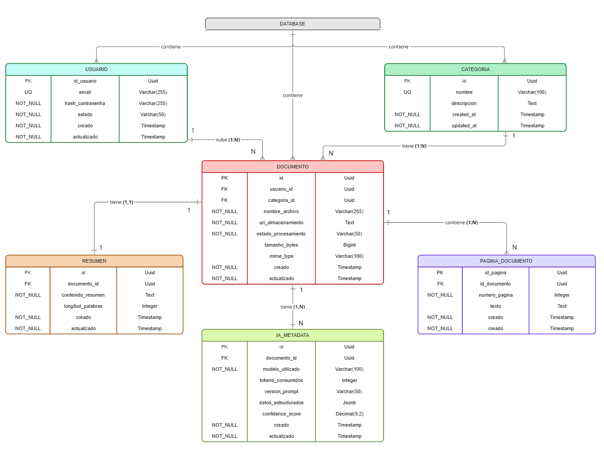

# AI Document Manager 📄🤖

Un moderno sistema para la gestión inteligente de documentos utilizando inteligencia artificial.

## 🚀 Base de datos: Neon

Toda la persistencia de datos está construida sobre **[Neon](https://neon.tech/)** (Serverless PostgreSQL).

Esto nos proporciona una base de datos Postgres *serverless* robusta, segura y escalable, que podemos gestionar directamente desde su panel web, permitiendo crear ramificaciones (branches) de datos para un entorno de desarrollo ideal.

## ⚙️ Configuración del Entorno Local

Para empezar a trabajar en el proyecto, necesitas configurar tus conexiones.

1. **Clona el repositorio**
2. **Crea tu archivo de entorno**:
   Duplica el archivo `.env.example` y renómbralo a `.env`:
   ```bash
   cp .env.example .env
   ```
3. **Configura tu conexión a Neon**:
   Abre el archivo `.env` recién creado y completa la cadena de conexión. Por ejemplo, necesitarás la URL de Postgres proporcionada por Neon:
   ```env
   DATABASE_URL="postgresql://[user]:[password]@[neon_hostname]/[dbname]?sslmode=require"
   ```
   *(Puedes encontrar tu cadena de conexión copiándola directamente desde el Dashboard de Neon en la sección de tu proyecto)*.

> **⚠️ IMPORTANTE - Seguridad**: 
> El archivo `.env` contiene contraseñas reales e información confidencial. **NUNCA debe ser comiteado ni subido a GitHub** (por eso está en el `.gitignore`). 
> 

## 📊 Arquitectura de Base de Datos

### Diagrama de Base de Datos
A continuación se presenta el Modelo Entidad-Relación Extendido (MERE) que define la estructura de la base de datos:



### Modelo Entidad-Relación
Para una comprensión profunda de las entidades, los atributos intervinientes y las decisiones de diseño aplicadas, hemos preparado un documento explicativo:

📄 **[Consultar Documento de Descripción de la Base de Datos](docs/BD/descripcion_BD.pdf)**
